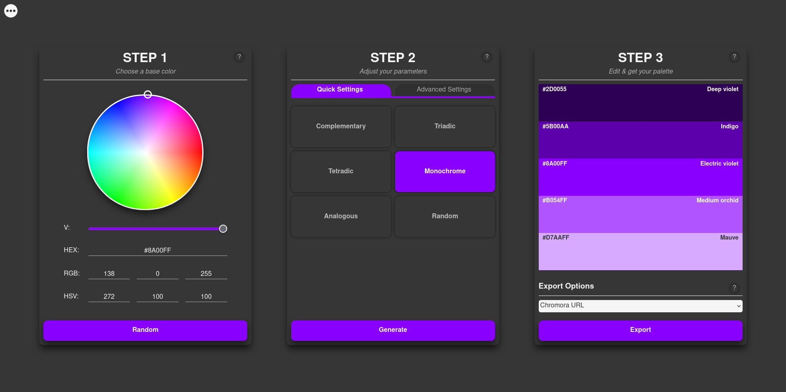

# CHROMORA - THE POWERFUL & FAST COLOR PALETTE GENERATOR

Chromora is a lightweight, powerful and fast color palette generator that can be used both online and offline as a PWA. 

## Why Chromora?

Why should you use Chromora for your color palette generator needs? Because:

* It's lightweight, the entire repo is less than 2.5mb, this even includes the files that are not necessary to run the app like this README, or the picture on it.

* It's powerful, Chromora doesn't limit you to the 5 most common color palette types, you can create palettes that can have up to 36,000 colors.

* It's fast, it can generate 360 colors and find you the names of the closest color to all of them in 100ms on a i3-6006 with 4gb of RAM.

* It can work offline without any limitations, all of its functions including exporting and importing work offline. You can even install it on your device as a PWA.

* No watermarks anywhere in the exports, 

* It's 100% FOSS, no log-ins, no pro subscriptions, no data collection, only colors!

## Want to give it a shot?

Check out the live instance [over here](https://chromora.com)!

If you want to host an instance for yourself, just clone the repo and host it, no special set-up is needed. 

You can also grab one of the zips from the releases for self hosting. These files are cleaned of any unnecessary files like this `README.md` file, or the `git-assets` directory. Additionally, the 'light' version leaves out the `app` directory as well, however this version will only work online as it lacks PWA capabilities.

## What's next?

Check the open issues, maybe you'll find something that interests you!

## What's not next?

Most likely full Webkit support unless someone makes a PR. I have no way of testing for iPhones or Macs. The only way I can test for Webkit is with Epiphany, on which everything seems to be fine (In reality, it's a mess on iPhones, a little better now on desktop Safari).

## "Your code sucks and is inefficient"

I know, it's a mess.